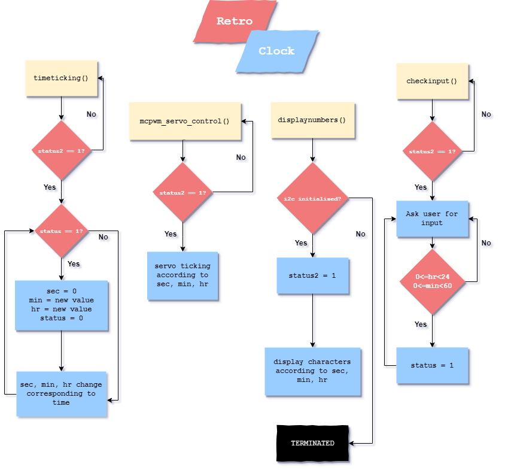
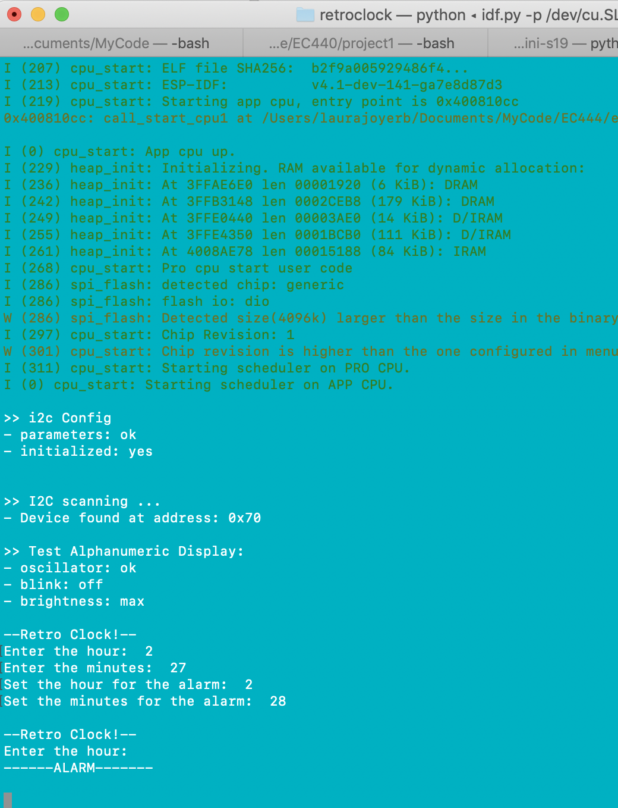

# Quest 1 Retro Clock
Authors: Yuting Chen, Erin Dorsey, Laura Joy Erb

2019-09-20

## Summary
Quest 1 Retro Clock consists of a clock-like mechanism that displays the current time on an alphanumeric display in hours and minutes as well as two servos that display minutes and seconds over a 180 degree range. A user can also set the time from the control panel with a console i/o function that sets both the alphanumeric display and the two servos. An alarm time can be set at the same time that the clock time can be set. When the time reaches the alarm time, an alarm message is displayed on the console.

## Evaluation Criteria
- Two servos accurately display the time
- Alphanumeric display accurately displays the time
- User can set time
- User can set an alarm

## Solution Design
###### Alphanumeric Display
One half of the alphanumeric display is allocated for minutes (00 - 59) and one for hours (00 - 23). After intialization but before user input, the alphanumeric display increments according to the time in the timeticking task. Once the time has been set, the alphanumeric display continues to count up according to time. 

###### Servos 
One servo is allocated to track seconds while the other tracks minutes. The seconds servo tracks the length of a minute over 180 degrees by setting a task delay of 6000 and the other tracks an hour with a delay of 36000. When time is set with the checkinput task, the minutes servo turns to an angle calculated by multiplying minute by 3, while the seconds servo return to 0 position. Once the angle is set, they continue to rotate, tracking time as normal by resuming timeticking task. 

###### Timing Method 
Our timing method is to use timeticking() task to give integer values of hour, minute. The three global variables are passed to displaynumbers() and mcpwm_servo_control to modify i2c display and servos. 

User input is controlled from the command prompt in the checkinput() task. The user enters minutes and hours after a prompt and the alphanumeric display changes accordingly. Once user input is collected, the checkinput() task changes status from 0 to 1, telling timeticking() task hours and minutes are newly set by user. Status value returns to 0 after the newly set time variables are applied. 

## Sketches and Photos
Flow Diagram:

Console Output for An Alarm:

## Supporting Artifacts
[Repo](https://github.com/BU-EC444/Team18-Chen-Dorsey-Erb/edit/master/quest-1)

[Video Link](https://drive.google.com/open?id=1eJ9ZWE4Y3rQb74IJ_91syjoeEhrUA0Ml)

## Investigative question
###### How can you synchronize multiple ESP clocks with each other?
Clocks can be synchronized with one ESP functioning as a "master" clock and the rest as "secondary" or "slave" clocks. These slave clocks will recieve information from the master ESP that provides them with the correct time. This signal will be sent regularly to ensure an accurate time is maintained by all ESPs. 

## References
https://github.com/BU-EC444/code-examples/tree/master/i2c-display
https://github.com/adafruit/Adafruit_LED_Backpack/blob/master/Adafruit_LEDBackpack.cpp
https://github.com/espressif/esp-idf/tree/master/examples/peripherals/mcpwm/mcpwm_servo_control

-----

## Reminders

- Video recording in landscape not to exceed 90s
- Each team member appears in video
- Make sure video permission is set accessible to the instructors
- Repo is private
