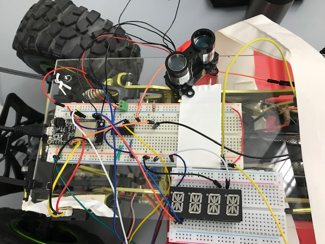
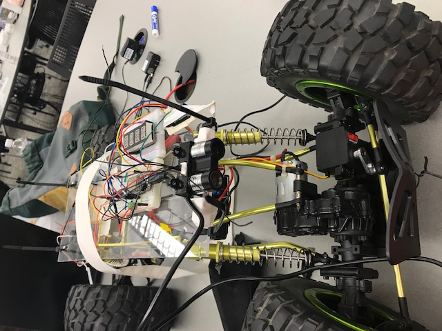

# Quest 4: Autonomous Driving on Track
Authors: Yuting Chen, Erin Dorsey, Laura Joy Erb

2019-11-08

## Summary
The goal of this quest was to program a small vehicle (crawler) to drive autonomously down a stretch of road in a straight line without colliding with the walls or end of the track. The crawler is controlled by various sensors including Lidar, IR, and an optical encoder. PID modules help with staying in a straight line and maintaining speed. 

## Evaluation Criteria
- Uses PID for speed control between 0.1 and 0.4 m/s: **Completed** 
- Stops within 10 cm of end: **Completed**
- Holds to center of the track +/- 25cm: **Completed**
- Successfully traverses A-B in one go, no hits or nudges: **Completed** 
- Uses alpha display to show current position or speed: **Completed**
- Controlled remotely, start and stop: **Completed**
- Investigative question response: **Completed**
- Additional Features:
    - Her name is Furiosa, and she has a pink bow attached to the back of the crawler
    - We made a fully functional handle for our crawler to ensure easy handling and safety

## Solution Design
##### Speed Control
The speed of the crawler is controled by the motor servo and regulated by a PID module. The optical encoder is mounted close to the wheel and measures the amount of 'ticks' that pass as the black and white encoder pattern turns. The encoder counts a tick when the input drops to below a control value of 4095 when it reflects against the white serface of the pattern rather than the black. We used a basic debouncer to ensure that we only count the pulse once when it drops instead of several times as it remains on the white surface. Knowing that there will be 6 ticks per rotation, we can time the number of ticks per second and find a value for rotations per second. Using the circumference of the tire at 0.62m we can convert that into meters per second and send the speed data back to the rest of the tasks. This speed is printed to the console and is sent to the speed PID module for regulation. The speed PID takes in the current speed value and adjusts the speed PWM based on its difference from 0.1 m/s. We used the error primarily as the largest coefficient Kp, and the secondary was the Kd coefficient for the derivative. We used a small coefficient for the integral because we found its values were counterproductive to the control. 

##### Collision Sensing
Collisions are detected by a LIDARLite V1 mounted on the front of the crawler. The LIDAR works by sending out a laser signal and measuring how it is reflected back to determine distance from an object. This was chosen as our collision detection sensor because it has the largest range of all available sensors at 0-40m and is generally accurate in practice. This range finder will set the status enable signal to 0, telling the crawler to stop, if it detects a collision. This stop signal is triggered if the LIDAR senses it is within 32cm to a wall. This 32cm allows for a buffer time for the signal to send and for the crawler to stop, resulting in a stop around 10cm from the collision surface. 

##### Driving Straight 
The crawler drives straightest when the steerAngle is set to 54. We initialize the crawler to this value on start up. When starting, the crawler measures the distance from the wall to its left and uses that as its setpoint for distance. It continuously reads the distance using the IR sensor. This distance is sent to a PID control function that determines the error from the initial setpoint. This PID control function uses the error primarily, and changes the steerAngle until the IR sensor reads the correct distance. At that point, the steerAngle is changed back to 54 to return the wheels to straight. The steering PID is also capped at a certain range to avoid overcorrecting due to the low speeds, so the steering angle is limited to 30-70º rather than the actual range of 0-100º. 

##### Remote Control
The autonomous crawler can be turned on remotely and ran from a webserver locally hosted on a machine. The web server is built using nodejs and html and sends data using socket.io and UDP. This server enables the ESP to run without being plugged into a laptop, which is a necessity for a mobile vehicle. When a user presses the "ON" button on the server page, a message is sent to the ESP that tells it to set status to 1, which in an enable signal for the crawler to increase the pulse width for movement. When a user presses the "OFF" button, the ESP sets status to 0, whichs sets the wheel pulse width to a stopping level.

## Sketches and Photos

  

  

 

## Investigative Question Response
##### Define what you would want in a better sensor for the vehicle. Be very specific in quantifying its performance. Please cite materials found on the web to support your response.
There are three main sensors that control our vehicle: LIDAR, IR rangefinder, and optical encoder, which control collisions, driving straight, and speed. The Lidar is the most useful sensor, with a range of 0-40m and accuracy of +/- 2.5cm (1). If this sensor could be improved at all it would be a better accuracy, ideally of +/- 1cm. The IR sensor is much less accurate, with a range from 20-150cm and an undetermined accuracy (2). We have found that this sensor is not particularly accurate and is not at all useful when detecting collisions due to its minimum range being 20cm. This sensor could be improved by accuracy of +/- 1 cm as well as a range that starts at 0 cm. Finally, the optical encoder is supposed to have a range of 0-50cm yet we have found through experiementation that it is most accurate within 0-1cm of a reflective surface (3). Ideally this sensor would have a greater accurate range of 0-10cm, which would make it possible to mount the sensor a safer distance away from the wheel. 

Sources:
1. https://github.com/PulsedLight3D/LIDAR-Lite-Documentation/blob/master/Docs/LIDAR-Lite-v1-docs.pdf
2. https://www.sparkfun.com/datasheets/Sensors/Infrared/gp2y0a02yk_e.pdf
3. https://learn.sparkfun.com/tutorials/qrd1114-optical-detector-hookup-guide#example-circuit

## Supporting Artifacts
- [Link to repo](https://github.com/BU-EC444/Team18-Chen-Dorsey-Erb/edit/master/quest-4)
- [Link to video demo](https://youtu.be/1QwLT7r5-9I)

## References
- [Crawler Speed & Steering Design Pattern](http://whizzer.bu.edu/briefs/design-patterns/dp-esc)
- [LIDARLite V1 Documentation](https://github.com/PulsedLight3D/LIDAR-Lite-Documentation/blob/master/Docs/LIDAR-Lite-v1-docs.pdf)
- [LIDARLite V1 Arduino Design Pattern](https://www.robotshop.com/community/blog/show/lidar-lite-laser-rangefinder-simple-arduino-sketch-of-a-180-degree-radar)
- [ESP-IDF I2C Tools](https://github.com/espressif/esp-idf/tree/39f090a4f1dee4e325f8109d880bf3627034d839/examples/peripherals/i2c/i2c_tools)
- [ESP-IDF ADC Example](https://github.com/espressif/esp-idf/tree/39f090a4f1dee4e325f8109d880bf3627034d839/examples/peripherals/adc)
- [PID Design Pattern](http://whizzer.bu.edu/briefs/design-patterns/dp-pid)
- [Optical Encoder Design Pattern](https://learn.sparkfun.com/tutorials/qrd1114-optical-detector-hookup-guide#example-circuit)
