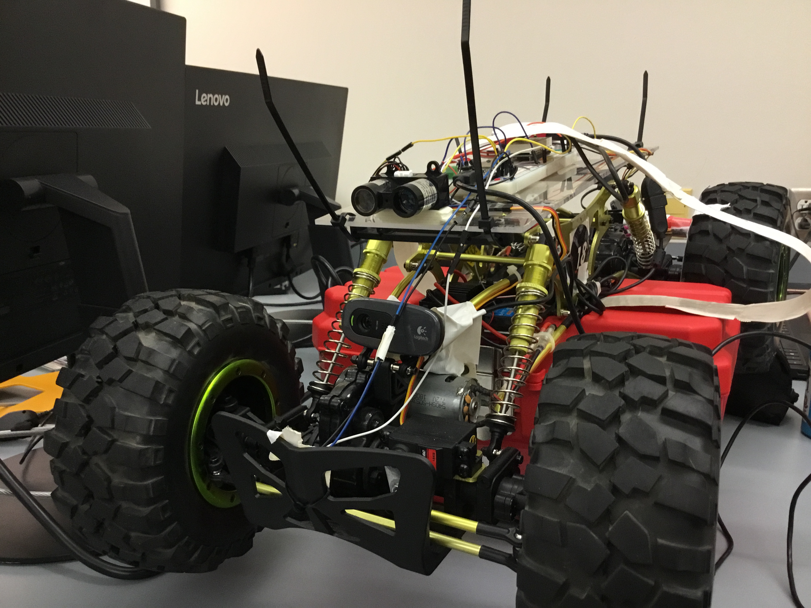
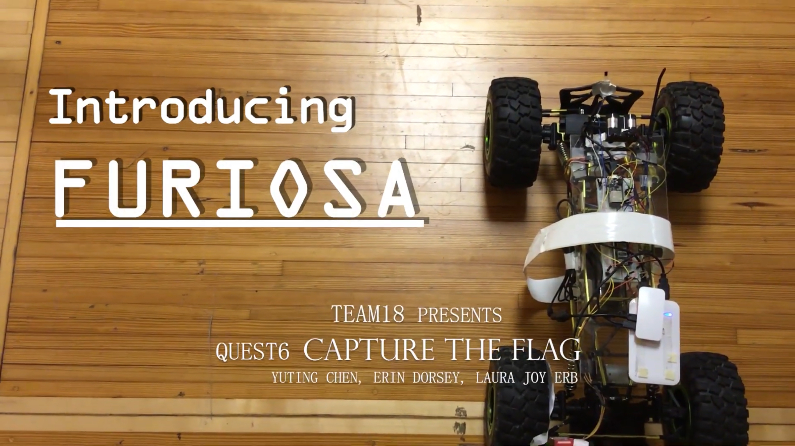

# Rollup – Capture the Flag Crawler-Style
Authors: Yuting Chen, Erin Dorsey, Laura Joy Erb

2019-10-12

## Summary
In this quest we built a crawler that can navigate a course both autonomously and with human control through a webserver, pass checkpoints, and capture the flag in the fastest time possible. 

## Evaluation Criteria
#### Web User Interface
- Functional web steering and speed control L,R,F,R, stop: **Completed**
- Web display showing historical splits from database: **Completed**
- Web stream from webcam crawler: **Completed**
- All web interfaces in same browser window: **Completed**

#### Devices
- Functional range sensors: **Completed**
- Functional collision sensor: **Completed**
- Functional PID control on variable speed setpoint: **Completed**
- Functional IR sensor: **Completed**
- Alpha display shows last beacon split time: **Completed**

#### Behaviors
- No collisions in runs: **Completed**
- Autonomous: drives straight on long walls without touching: **Completed**
- Autonomous: makes turns, L or R turns around obstacles: **Completed**
- IR receiver on car receives data from beacon: **Completed**
- Car conforms to IR traffic signals (stop and go): **Completed**
- Browser or Rpi decodes and displays value of QR code: **Completed**
- System records split time to DB: **Completed**
- Able to remote drive vehicle: **Completed**

#### Overall Quality, Repeatabilty, Robustness
- Completes the course without nudges or touches: **Completed**

#### Additional Features
- Aesthetic crawler design 
- Easy lifting mechanism 

## Solution Design
#### Autonomous Navigation
Under autonomous mode, the crawler by default moves straight in forward direction. Once the side sensor senses a wall within 1 meter range, the crawler starts to make small turns and adjust itself to move along the wall within a range of 70-80cm. If the front sensor senses a wall within 2 meters while another wall is detected on the side, autonomous status is set to corner, and the crawler turns left 90 degrees. When the crawler encounters traffic lights, it stops and continues autonomously according to the light color. The first traffic light initializes the start time. Latest split time is shown on alphanumeric display and all split times are stored in server database. 

#### Manual Control
Under manual mode, the crawler moves under the user command. When the crawler encounters traffic lights, the user can determine whether or not they wants to run the red light. Split time behaves the same way. The manual mode allows for movement forward, backward, left and right. The direction can be changed as the crawler is moving, or it can be changed while it is stationary.

#### Web Server
The web server is built with node js and an html frontend. This server displays the webcam feed, QR decode, speed of crawler, and historic split time data. The server also has a hub for controlling the crawler with buttons including auto/manual, forward, backward, left, right, and stop/go. The index.js file recieves messages from the ESP32 using IPchat in the form of a string that has beacon ID, speed, and the hours, minutes, and seconds of the latest split time. The data for beacon ID and split time are stored in the database. Then, all of this data is loaded from the database and sent to the html file with socket.io. When the control buttons are pressed on the index.html file, integer values are sent to the index.js file with socket.io and index.js sends them to the ESP32 with IPchat. 

#### Webcam QR Decode
The QR code is read through a webcam feed that is generated by a motion module hosted on the Raspberry Pi. This webcam feed is sent to the webserver and displayed in an image tag. In an interval function that repeats every second, the image of the webcam feed is drawn onto an html canvas element. This image still is then converted into imageData, which is an array of pixels that is equivalent to the image. This data is then passed to jsQR, a QR code decoding module, which takes the decoded data and displays it on the webpage underneath the video stream. 

## Sketches and Photos

  

 

  

 

  

 

## Supporting Artifacts
- [Link to repo](https://github.com/BU-EC444/Team18-Chen-Dorsey-Erb/tree/master/quest-6)
- [Link to video demo](https://youtu.be/5c00FggDjg4)

## References

-----
- [Ultrasonic Data Sheet](https://www.maxbotix.com/documents/HRLV-MaxSonar-EZ_Datasheet.pdf)
- [LIDAR Data Sheet](http://static.garmin.com/pumac/LIDAR_Lite_v3_Operation_Manual_and_Technical_Specifications.pdf)
- [Optical Encoder Guide](https://learn.sparkfun.com/tutorials/qrd1114-optical-detector-hookup-guide#example-circuit)
- [Webcam Stuff](https://pimylifeup.com/raspberry-pi-webcam-server/)
- [QR Code Stuff](https://github.com/cozmo/jsQR)
- [IR Receiver](https://www.sparkfun.com/datasheets/Sensors/Infrared/tsop382.pdf)
