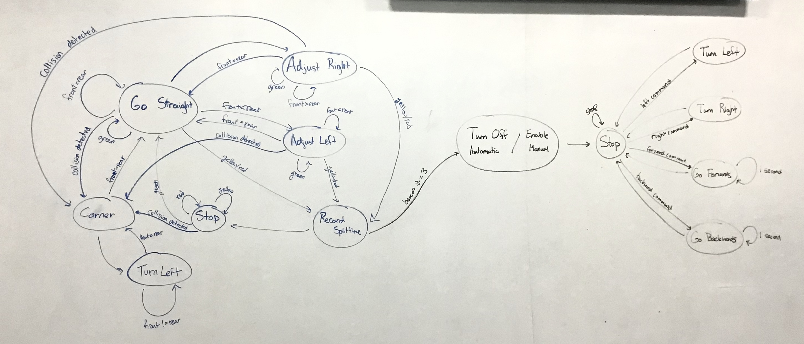

#  Navigation

Author: Yuting Chen, Erin Dorsey, Laura Joy Erb, 2019-12-03

## Summary
We outlined our plan for the crawler navigation. This included the summary of the components and their communication as well as a state diagram outlining the inputs, outputs, and various states.

## Sketches and Photos
The state diagram:

And the video describing the communication plan between the components of the quest:
- [Link to video](https://drive.google.com/open?id=1YvWuKdLU8hjTlGdecgmoxNf9Ak5nxR9w)
