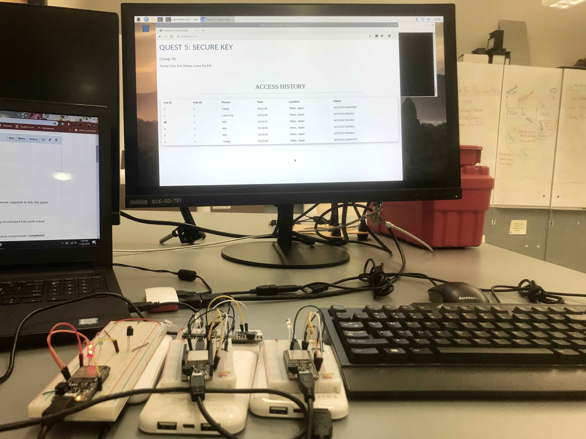
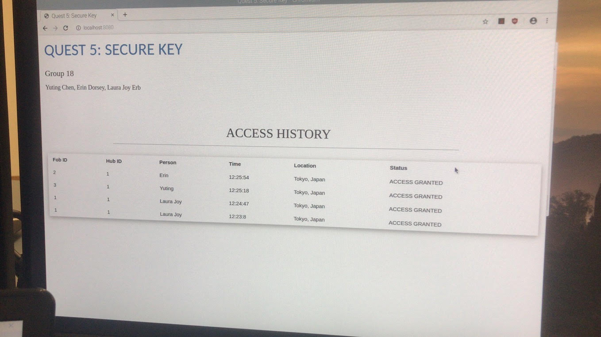
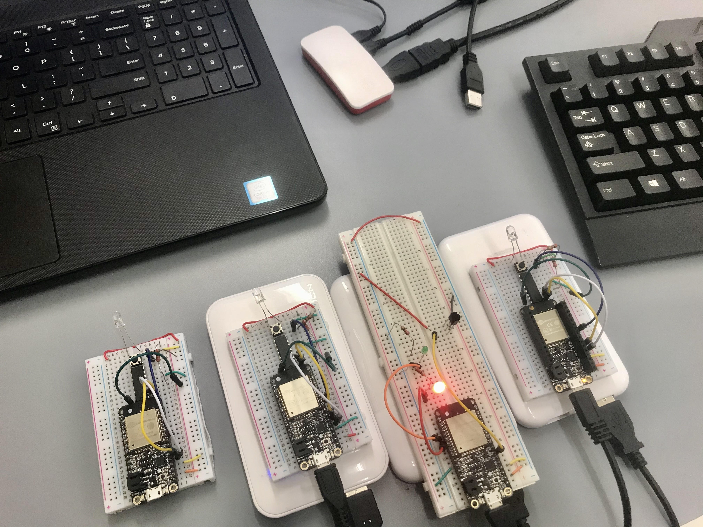
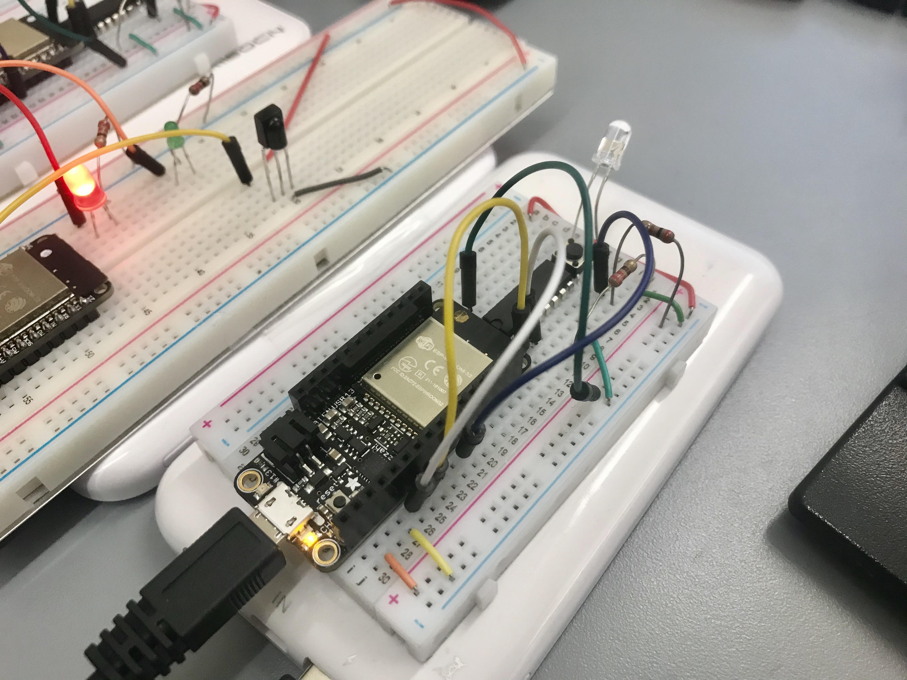
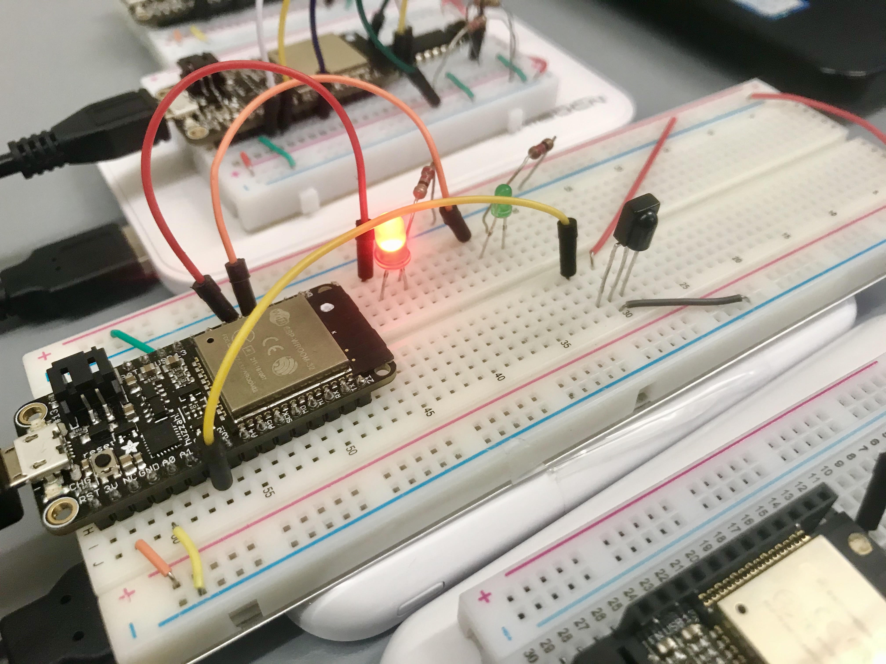

# Quest 5: Secure Key
Authors: Yuting Chen, Erin Dorsey, Laura Joy Erb

2019-11-21

## Summary
The goal of this quest is to build multiple portable secure key fobs that can unlock specific hubs by a simple press of a button that transmits NFC (near field communication) message to the hub's reciever. The hub logs the fob's request; and if the ID and passcode are correct, the hub grants the fob access. Verfication is done by RPi server that communicates to all devices through IP chat. Access history of unlock fobs is stored in a RPi DB as well as shown on a web-based management interface. 

## Evaluation Criteria
- Fob relays {fob_ID,code} to security hub, hub sends {fob_ID,hub_ID,code} to server; server responds to fob, fob green light turns on: **Completed** 
- Logs fob accesses to database {fob_ID,hub_ID,person,time,location}: **Completed**
- Database is on RPi: **Completed**
- Web-based management interface shows real-time active unlocked fobs and history of unlocked fobs (with actual time of unlock): **Completed**
- Uses at least 3 fobs with unique IDs: **Completed**
- Demo delivered at scheduled time and report submitted in team folder with all required components: **Completed**
- Investigative question response: **Completed**
- Additional features: 
    - Autolocks after 7 seconds to prevent unauthorized access: **Completed**
    - Does not crash if multiple key fobs are entered: **Completed**
    - Key fobs are on small, portable breadboards for ease of use: **Completed**

## Solution Design
#### Fob
The fob consists of an ESP, an H-bridge, a button, and an IR LED. We use the ESP RMT API to produce a 38kHz clock signal off of pin A0. We use UART to transmit the message to pin A1. A0 and A1 signals are and'd in the H-bridge and the output is fed to the button. Once the button is pressed, a transmission is triggered. The "payload" of the transmission is the four digit passcode followed by a space and then the fob id. In order to ensure that the transmission is received (or at least increase the odds of it being received), the message is transmitted several times and with a header of 'AAA'. So, for example, a button press will trigger the transmission of a message "AAACODE KEY_ID AAACODE KEY_ID AAACODE KEY_ID". This message is sent 10 times over the course of one second. 

#### Hub
The hub's IR receiver is always waiting for a transmission. When it receives the transmission, it reads in the whole string and begins scanning for the 'AAA' header. Once the header is found, it then takes the next four characters as the code, and after the space, the following character as the fob id. Before we were sending redundant messages, the hub would occasionally lose the first character or so, and would only get the latter half of the message. By using the header, we are much more likely to receive the correct message even if it wasn't read on the first try. After receiving the transmission, the hub sends the data to the server over the local network. 

#### Server and Web-based Management Hub
The RPi server is communicating to all the fobs and hubs through IP chat based on the unique fob IDs and hub IDs. Only a certain number of users have access to hubs, and these users have to log in with a correct passcode. By default, the message sent back from server to all devices is '0', suggesting that no keys has access to hubs. Once a hub recieves the near-field communications (NFC) message transmitted from a fob, the hub sends a data string consisting fob ID, hub ID, and passcode to the RPi server. The server first looks up the person by the unique fob ID, and locates the access by the unique hub ID. Then, the server checks if the passcode is correct. If both the person and the passcode are verified, the server grants the fob for a 7-second access to that specific hub by sending message '1', while other hubs and fobs remain locked.

The server also builds a web-based management interface that shows access history of unlocked fobs with actual time of unlock. Once a fob asks for access, the fob ID, hub ID, person, location, time, and access status appear immediately on the web interface. The web interface updates in real time and is accessible all devices connected to that WIFI. 

#### Database
The database is built off the key value database package LevelDB, which is compatible with node and the rasberry pi. The index.js file recieves a transmission from the hub ESP containing fob_ID, hub_ID, and passcode. The server.js file extrapolates from these three values the person, location, time, and access status. These values are written to the database according to a incremented key to avoid any values being overwritten. These values are then loaded from the database and sent to the html file for display on the Web-based management interface.

## Sketches and Photos

 

 

 

 

## Investigative Question
#### Comment on the security of your system. How would you best hack into this system if you were so inclined? How could you prevent this attack?
Our system has its main vulnerabilities in the communication “joints”. 

The security hub will accept IR transmissions from any transmitter, not just our keys. While we do have a passcode to unlock the hub, it is not a very complex code and could easily be hacked. If a BG were to find out the passcode, they could easily unlock our security hub. Additionally, there is no lockout after a certain number of failed attempts, so the BG could cycle through a bunch of codes until they succeeded (say, in a program that would run overnight trying different codes).

A BG could also create their own receiver and receive the transmission transmitted by an actual key. This would immediately give them access to the fob id and the code to unlock the hub. Using this, a BG could easily create their own key fob to access the security hub. 

The hub communicates the fob id, hub id, and code to the server. However, one could send false data to the server and mimic that of a security hub. A BG could falsify data and pretend to be somebody else, or to be at another location. 

Once the server receives the data, it uploads the fob id, hub id, person, location, status, and time to the database. A BG could upload their own data to the database and pretend to have unlocked the security hub, falsifying records for the html file and potentially sending an unlock signal from the server to the key fob. 

One way to prevent some of these attacks would be to have more complex fob ids and hub ids. The checking for an unlock would have to verify the puck id, hub id, and code before allowing an unlock to occur. The chances of the BG getting all three codes is far lower. 

In order to prevent the BG creating their own key after receiving the transmission from a correct key would be to change the code frequently, or even after every entry. After every entry, the server could generate a random code, send that back to the key fob, and then invalidate the previous code. Any future attempts with the old code would be blocked. 

Sources:
 - https://techtutorialsx.com/2018/01/03/esp32-arduino-basic-authentication/
 - https://www.alanzucconi.com/2015/08/19/how-to-hack-any-ir-remote-controller/

## Supporting Artifacts
- [Link to repo](https://github.com/BU-EC444/Team18-Chen-Dorsey-Erb/tree/master/quest-5)
- [Link to video demo](https://youtu.be/mNXADMlVO0k)

## References
- [Database Design Pattern](http://whizzer.bu.edu/briefs/design-patterns/dp-db)
- [IR Comms Design Pattern](http://whizzer.bu.edu/briefs/design-patterns/dp-irtxrx)
- [ESP32 RMT API](https://docs.espressif.com/projects/esp-idf/en/latest/api-reference/peripherals/rmt.html#)

-----

## Reminders

- Video recording in landscape not to exceed 120s
- Each team member appears in video
- Make sure video permission is set accessible to the instructors
- Repo is private
