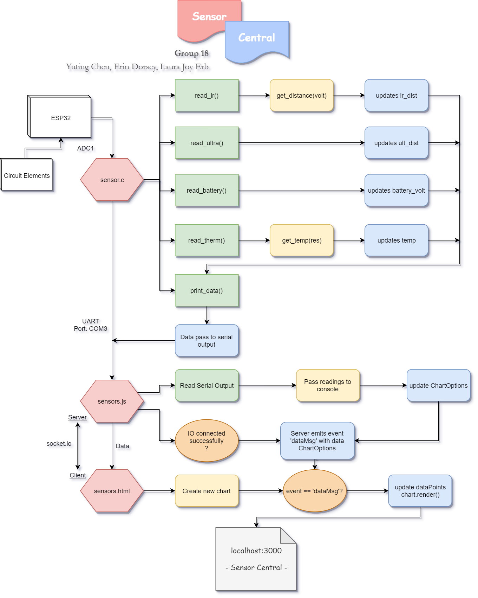
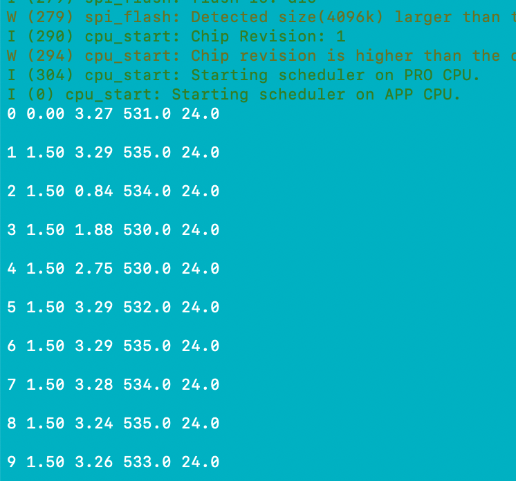
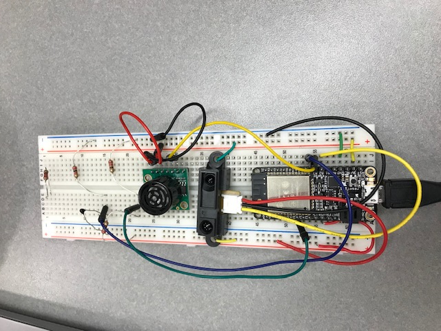

# Quest 2 Sensor Central
Authors: Yuting Chen, Erin Dorsey, Laura Joy Erb

2019-10-08

## Summary
The goal of this quest is to build the ultimate multi-purpose sensor for use in a place such as Grand Central Station. This "Sensor Central" is able to read temperature using a thermistor, give distance based on an ultrasonic sensor and an IR rangefinder, and shows battery voltage with a voltage divider. Each sensor output is measured as an analog signal which is taken to the console, and dynamically graphed to a web server using Node.js, Socket.io, and CanvasJS library.

## Evaluation Criteria
- Periodic reporting of ultrasonic range in m: **Completed**
- Periodic reporting of IR range in m: **Completed**
- Periodic reporting of temperature in C: **Completed**
- Results graphed at host: **Completed**
- Results graphed continuously based on reporting period: **Completed**
- Demo delivered at scheduled time and report submitted in team folder with all required components: **Completed**
- Investigative question respose: **Completed**
- Additional functionality:
  - Battery Voltage Sensor
  - Three auto-ranging y axes
  - Limiting of datapoint length (to avoid overcrowding in browser)

## Solution Design
##### Sensors:
One ultrasonic range sensor(MB1040) and one IR rangefinder(GP2Y0A02YK0F) are used to measure distance, one thermistor(NTC mf52-103) is used to measure temperature, and one voltage divider is used to display battery voltage. All of the sensors use ADC to send sensor data from the sensors to the sensors.c file. Each sensor has a separate task to read and calculate the appropriate values for that sensor. The battery voltage sensor did not need any calibration as the input was just converted to a voltage output with an adc built in function. For the thermistor, we used a reference chart of resistance versus temperature to calculate the voltage in the thermistor voltage divider for each temperature. Then we wrote an if statement that would output the correct temperature based on the input voltage range. The IR sensor was calibrated in a similar way. Initially we tried to use the graph provided in the sensor documentation for an if statement that would output the correct distance based on the voltage range. However, we found through testing that this graph was inaccurate. Using a rule and a piece of paper we took several readings and formulated our own chart to base the if statement on. The IR sensor data was also converted from millimeters to meters before being stored. Finally, the ultrasonic sensor was calibrated by multiplying the analog input by 5 and adding 30 cm, as the sensor cannot read below 30 cm. Then this value was converted to meters and stored. These values are stored in global variables in sensor.c. A separate task prints the values from the sensors to the console every second.

##### Server:
Node.js is used as a server environment in our quest. The sensors.js program reads from the serial port file (where sensor.c printed sensor data) and adds the data points to the datapoints arrays. The arrays are fed to the chartOptions variable that houses all information and customization information for the CanvasJS chart. Using socketio, the sensors.js file emits the chartOptions variable to the sensors.html file.

##### Graphing:
The sensors.html file receives the chartOptions variable via socketio from the sensors.js file. When the user opens localhost:3000, the io event changes from 'connected' to 'DataMsg', which emits the current value of chartOptions. The user can immediately see all the sensor data displayed on a chart using the CanvasJS library. Every second, the sensors.js file calls another io.emit('DataMsg'), which resends the chartOptions variable. The sensors.html file updates the chart with the new data points without having to refresh the page. 

The CanvasJS chart displays all four sensor data on the same chart with three different y axes marking units. One y axis marks temperature for the thermistor, one marks voltage for the battery monitor, and one marks distance for the IR sensor and the ultrasonic sensor. All three axes autorange based on the data fed in from the server. This ensures that all values are displayed in a manner that is clear and easy to read.

Additionally, the server enforces a maximum number of data points to be displayed on the client. If the data points exceed 30 readings, the server shifts the array to remove the first data point and append the most recent data point to the end of the array. This prevents overcrowding of the chart that made reading sensor data difficult.

## Sketches and Photos

A flow diagram of the functionality of this quest (and how every piece talks to everything else):

The console output from running just the sensors.c file (what is read by the sensors.js file):

The breadboard with all sensors wired up:

## Supporting Artifacts
- [Link to video demo](https://youtu.be/JaBqYMNhDMA)

## References
https://www.pololu.com/product/1137

https://www.sparkfun.com/datasheets/Sensors/Infrared/gp2y0a02yk_e.pdf
https://www.mouser.com/datasheet/2/240/Littelfuse_Leaded_Thermistors_Interchangeable_Ther-1372423.pdf
http://2avrmz2nom8p47cc28p2743e-wpengine.netdna-ssl.com/wp-content/uploads/2010/11/Thermistor_10K-2.pdf
https://www.maxbotix.com/documents/HRLV-MaxSonar-EZ_Datasheet.pdf
https://www.labfruits.com/esp32-adc-speed/

https://www.espressif.com/sites/default/files/documentation/esp32_datasheet_en.pdf

## Investigative Question
##### How fast can you sample each sensor and at what resolution based on the data sheet specs for each item?

The thermistor has a resolution of ±1ºC. The ultrasonic sensor has a 5mm resolution (when using the analog voltage output pin), and can be sampled every 100ms, or at a 1Hz sampling rate. The ultrasonic sensor can have a resolution up to 1mm when using the serial output or the pulse width. The infrared sensor has a 26Hz sampling rate.

The ESP32 ADC pins used a bit width resolution of 12, and it have a sampling rate of 200,000 samples per second. Because the sensors have lower sampling rates than the ESP32, the sampling rates for the sensors are the limiting factor for this project. 
