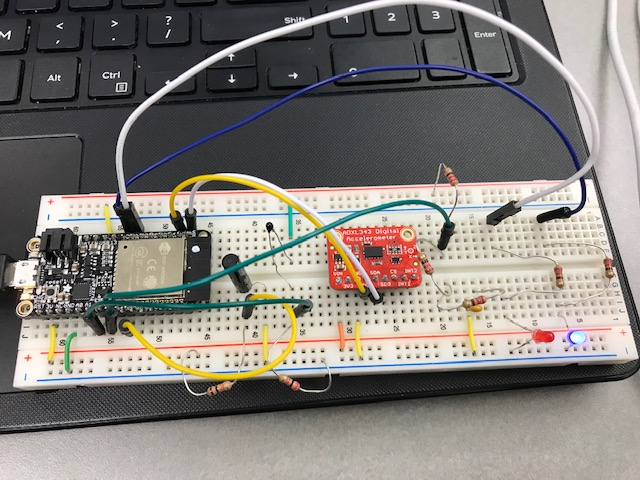
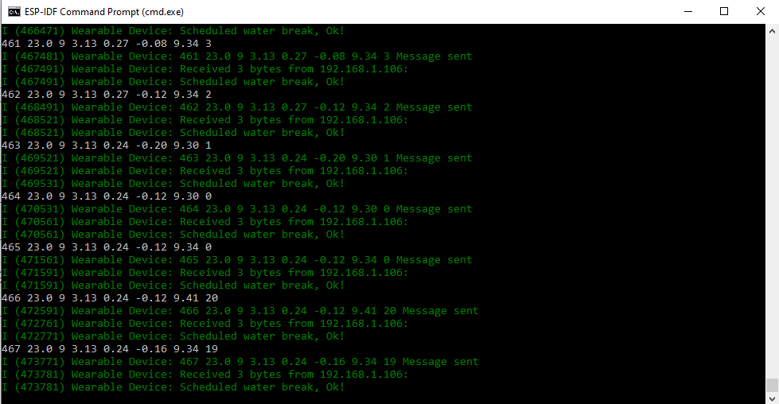
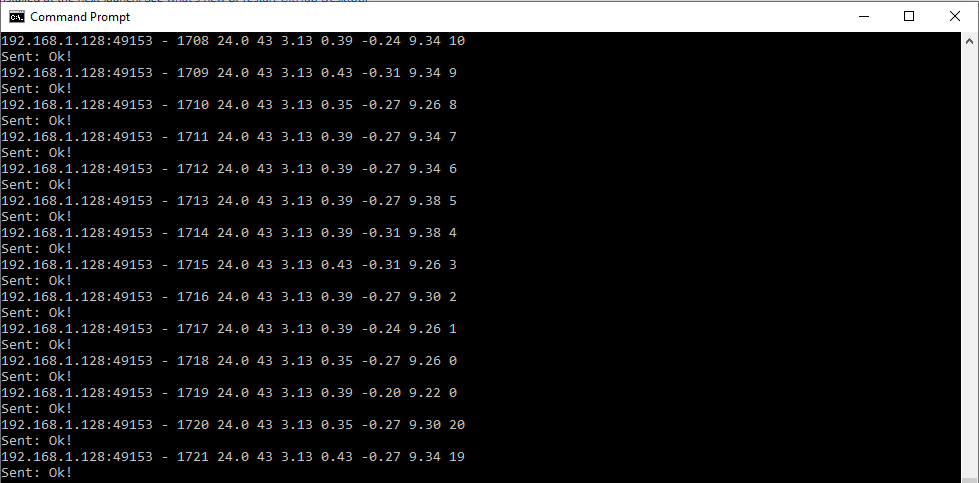

# Quest 3 - Wearable Computer with Remote Access 
Authors: Yuting Chen, Erin Dorsey, Laura Joy Erb

2019-10-24

## Summary
The goal of this quest was to build an instance of a wearable device that records biometrics and reports back to a central graphical hub. This graphical hub displays data from an accelerometer, a thermistor, a battery sensor, and a step counter. Through the hub a user can set "water alerts" that set an LED to go off after a certain amount of time or in an instant. 

## Evaluation Criteria
1. Sends data across separate IP network to control remote device through web client: Completed
2. Receives data across separate IP network from remote sensors into web client: Completed
3. Incorporates time and alert scheduling via web client: Completed
4. Ability to trigger an immediate alert: Completed
5. Web client displays biometrics in real-time: Completed
6. Demo delivered at scheduled time and report submitted in team folder with all required components:  Completed
7. Investigative question response: Completed
8. Additional functionality:
    - Red LED blinks when the device connects to the server
    - Presented graph of acceleration in three axes
    - Ability to customize display page (hide / show components)
    

## Solution Design
##### Sensors
The first sensor is triple-axis accelerometer that senses acceleration in the x, y, and z directions. A vibration sensor also counts "steps" by recording each time it is shaken or tapped. The ESP32's onboard LED will also flash with each step. A thermistor is also included to measure body temperature of the user. Finally, a battery sensor will show the level of power going into the device. Additionally, there two LEDs included on the wearable device that light up dependent on input from the graphical hub. The red LED blinks when it connects to the server, and the blue LED is the water break alarm. It blinks every 20 seconds by default, but this can be customized from the client to any time, including immediate.

##### Graphical Hub
The graphical hub consists of a html page connected to a node.js server that uses canvas.js for pretty displays. The chart variables are sent to sensors.html from server.js using socketio. The accelerometer data for the x, y, and z direction is graphed together. Below that is a display of step count, seconds till next water alert, and an interface to set the water alert. Below that, body temperature and battery level are graphed seperately. Each graph will shift after 40 datapoints to avoid overcrowding on the display.

##### Wifi/IPChat
To make our device more portable, we establish the IP communication between the esp32 client and the laptop server with UDP socket, so that the device can be carried around freely by the user. The esp32 sends a string consisting local time, temperature, steps, battery voltage, x, y, z, and time left to next water time to the host ip every second when the wearable device is powered. Normally, the server catches the data string and responds "Ok!", but if the user sets a new alarm, the response is the new alarm value. 

##### DynDNS
After setting up our Linksys router to connect to our [Wearable Device webpage](http://ec444team18.hopto.org:7000), remote devices can access the web server's localhost through DDNS. 

## Sketches and Photos
Here is the wiring of the wearable device:

  

 

The following two photos are to demonstrate the IP Chat between the device and the server using UDP packets. 

 

 

## Investigative Question
##### What are steps you can take to make your device and system low power? Please cite sources for you answer.
There are two modules that we could alter in order to make our wearable device and system low power. The first would be taking several steps to help the ESP32 use first power. This would include lowering the frequency we use to blink the LED, further optimize with the use of pull-up resistors, and optimize the run time of our code. We could also implement a "deep sleep" mode so that when our device is not in use the ESP32 would go to a low power mode, and would return fully when the user turned it back on. Specifically for this quest, we chose to simply "hide" sensors on our hub instead of entirely turning them off. If we made a function to turn off individual sensors as the user chooses that would make it more energy efficient. 
The second aspect of the design that we could change is the router. Our router uses significantly more power than we need for our purposes. We can change the setting on our router to reduce the maximum power allowed. This would reduce the range of our router, but for the purposes of the quest that shouldn't be a problem. 

Sources:

http://iot-bits.com/ultra-low-power-design-esp32-10-tips/  

https://randomnerdtutorials.com/esp32-deep-sleep-arduino-ide-wake-up-sources/  

https://macintoshhowto.com/internet/how-to-lower-the-power-output-of-your-wifi-router-if-you-live-in-the-us.html  

## Supporting Artifacts
- [Link to repo](https://github.com/BU-EC444/Team18-Chen-Dorsey-Erb/tree/master/quest-3)
- [Link to video demo](https://youtu.be/4q7fANdBq2Q)
- [Wearable Device Webpage](http://ec444team18.hopto.org:7000/)

## References
[Design pattern - socket on node.js](http://whizzer.bu.edu/briefs/design-patterns/dp-sockets)

[Design pattern - I2C](http://whizzer.bu.edu/briefs/design-patterns/dp-i2c)

[Espressif UDP client sample](https://github.com/espressif/esp-idf/tree/master/examples/protocols/sockets/udp_client)

[Adafruit ADXL343 learning guide](https://learn.adafruit.com/adxl343-breakout-learning-guide/overview)

[Espressif LED control guide](https://docs.espressif.com/projects/esp-idf/en/latest/api-reference/peripherals/ledc.html)

[Espressif MCPWM guide](https://docs.espressif.com/projects/esp-idf/en/latest/api-reference/peripherals/mcpwm.html)

-----

## Reminders

- Video recording in landscape not to exceed 120s
- Each team member appears in video
- Make sure video permission is set accessible to the instructors
- Repo is private
